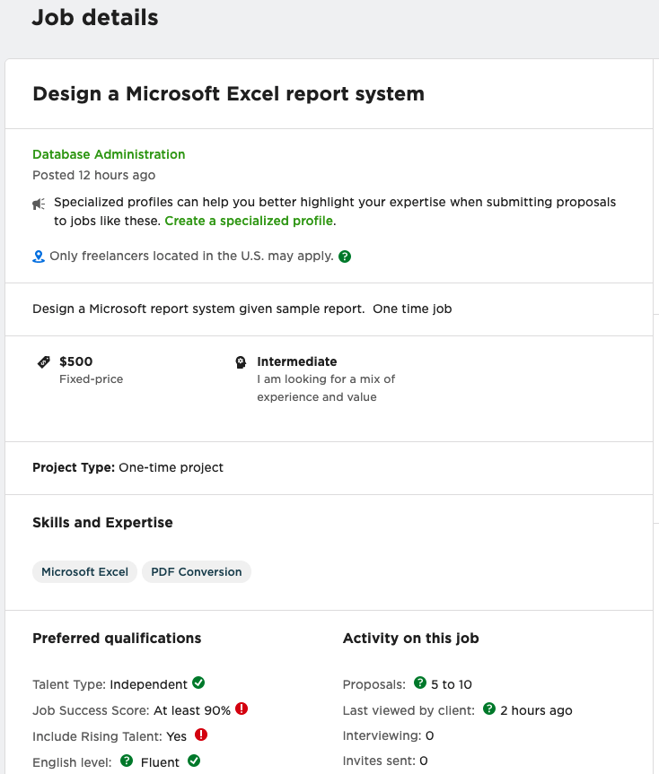

# Scanning Task


## Description

#### Task: 

- Log into **upwork.com**  
- Scan the information from the site and return structured data

```
Username:      ***
Password:      ***
Secret answer: ***
Portal link:   https://www.upwork.com/ab/account-security/login
```


## Stack

python, scrapy, selenium


## Spider Flow


### Before Login

Will use selenium to get passed the login page

Start url: https://www.upwork.com/ab/account-security/login

#### Username Page

solution: use selenium to input username and click continue


##### username input

```html
<input data-v-9baadd78="" data-v-17f0650e="" id="login_username" name="login[username]" placeholder="Username or Email" aria-label="Username or email" inputmode="username email" autocomplete="username" type="text" class="up-input">
```

##### continue button

```html
<button data-v-0c7bde74="" data-v-733406b2="" id="login_password_continue" button-role="continue" type="button" class="up-btn mr-0 full-width mb-0 up-btn-primary" data-v-44072c38="">Continue</button>
```


#### Password Page

solution: use selenium to input password and click log in


##### password input

```html
<input data-v-9baadd78="" data-v-17f0650e="" id="login_password" name="login[password]" placeholder="Password" aria-label="Password" autocomplete="current-password" type="password" class="up-input">
```

##### log in button

```html
<button data-v-0c7bde74="" data-v-58ebcdf7="" id="login_control_continue" button-role="continue" type="button" class="up-btn mr-0 width-sm mb-0 up-btn-primary" data-v-44072c38="">Log in</button>
```


#### Security Question Page

solution: use selenium to input secret answer and click continue


##### username input

```html
<input data-v-9baadd78="" data-v-17f0650e="" id="login_deviceAuthorization_answer" name="login[deviceAuthorization][answer]" placeholder="Your Answer" type="password" class="up-input">
```

##### continue button

```html
<button data-v-0c7bde74="" data-v-3eaab1b2="" id="login_control_continue" button-role="continue" type="button" class="up-btn mr-0 width-sm up-btn-primary" data-v-f2a8dda2="">Continue</button>
```


#### reCaptcha page

solution: pause the scraper by asking for user input. Let user complete the reCAPTCHA process and prompt the scraper to continue


## After Login

After login user  is redirected to https://www.upwork.com/ab/find-work/domestic


Looking at XHR request in chrome dev tools can see there is a GET reqest to upworks API

- https://www.upwork.com/ab/find-work/api/feeds/search?user_location_match=1

This returns the following JSON


Points of interest

- paging 

  - gives us pagination info

    ```json
    "paging": {
      "total": 53,
      "offset": 0,
      "count": 10,
      "resultSetTs": 1613617811311
    }
    ```

    

- results

  - gives info about each list item on the page

  - sample item:

  - ```json
    {
    "title": "Design a Microsoft Excel report system",
    "createdOn": "2021-02-18T03:10:11+00:00",
    "type": 1,
    "ciphertext": "~01f4053f6d37b4f9f2",
    "description": "Design a Microsoft report system given sample report.  One time job",
    "category2": null,
    "subcategory2": null,
    "skills": [],
    "duration": null,
    "shortDuration": null,
    "durationLabel": null,
    "engagement": null,
    "shortEngagement": null,
    "amount": {
        "currencyCode": "USD",
        "amount": 500
    },
    "recno": 222881809,
    "uid": "1362237947263033344",
    "client": {
        "paymentVerificationStatus": null,
        "location": {
          "country": "United States"
        },
        "totalSpent": 0,
        "totalReviews": 0,
        "totalFeedback": 0,
        "companyRid": 0,
        "companyName": null,
        "edcUserId": 0,
        "lastContractPlatform": null,
        "lastContractRid": 0,
        "lastContractTitle": null,
        "feedbackText": "No feedback yet",
        "companyOrgUid": "1257257427128717312",
        "hasFinancialPrivacy": false
    },
    "freelancersToHire": 0,
    "relevanceEncoded": "{\u0022position\u0022:\u00220\u0022}",
    "enterpriseJob": false,
    "tierText": "Intermediate",
    "tier": "Intermediate",
    "tierLabel": "Experience Level",
    "isSaved": null,
    "feedback": "",
    "proposalsTier": "5 to 10",
    "isApplied": false,
    "sticky": false,
    "stickyLabel": "",
    "jobTs": "1613617811311",
    "prefFreelancerLocationMandatory": true,
    "prefFreelancerLocation": ["United States"],
    "premium": false,
    "plusBadge": null,
    "publishedOn": "2021-02-18T03:10:11+00:00",
    "renewedOn": null,
    "sandsService": null,
    "sandsSpec": null,
    "sandsAttrs": null,
    "occupation": null,
    "attrs": [
        {
        "parentSkillUid": null,
        "freeText": null,
        "skillType": 3,
        "uid": "1031626758615973888",
        "highlighted": false,
        "prettyName": "Microsoft Excel"
        },
        {
        "parentSkillUid": null,
        "freeText": null,
        "skillType": 3,
        "uid": "1031626768082518016",
        "highlighted": false,
        "prettyName": "PDF Conversion"
        }
    ],
    "isLocal": false,
    "workType": null,
    "locations": [],
    "occupations": {
        "category": {
        "uid": "531770282580668419",
        "prefLabel": "IT \u0026 Networking"
        },
        "subcategories": [
            {
            "uid": "531770282589057033",
            "prefLabel": "Database Administration"
            }
        ],
        "oservice": {
            "uid": "1017484851352699011",
            "prefLabel": "Database Administration"
        }
    },
    "weeklyBudget": null,
    "hourlyBudgetText": null,
    "tags": [],
    "clientRelation": null
    }
    ```


### Job Details Page - Item View

After clicking on a list item, we are taken to a job details page.




## Performance - reducing requests to the Upwork server

As most of the information here is available from the <u>list view API</u> we may not need to scrape each profile page.

This would greatly reduce the number of requests needed.

54 items across 6 pages:

- list and item view: 60 requests
- list view only: 6 requests ( **90% reduction** )


Looking further into the API, we can see the next page url is:

- https://www.upwork.com/ab/find-work/api/feeds/search?max_result_set_ts=1613666702146&paging=10;10&user_location_match=1


After testing the url in postman we can decide the number of items per page by changing the **10** before the ''**&**'' sign

- as we have the pagination info from the initial request we can get all the items with 2 requests
  - 1st: to get paginaton info with number of items (e.g. 53)
  - 2nd: https://www.upwork.com/ab/find-work/api/feeds/search?paging=0;53&user_location_match=1
- This means we only have to do **two requests to the server (97% reduction)**

